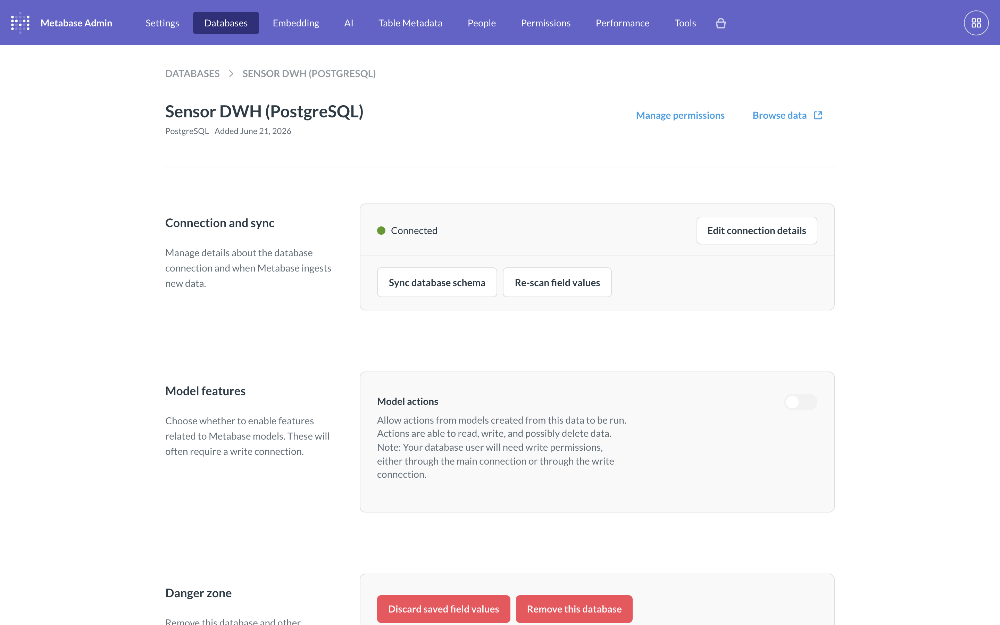
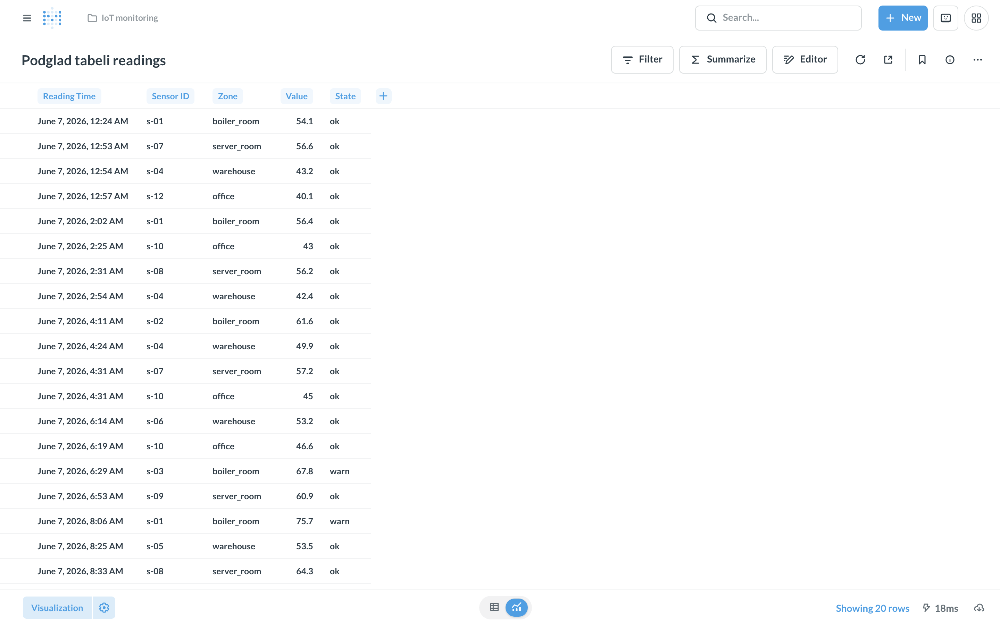
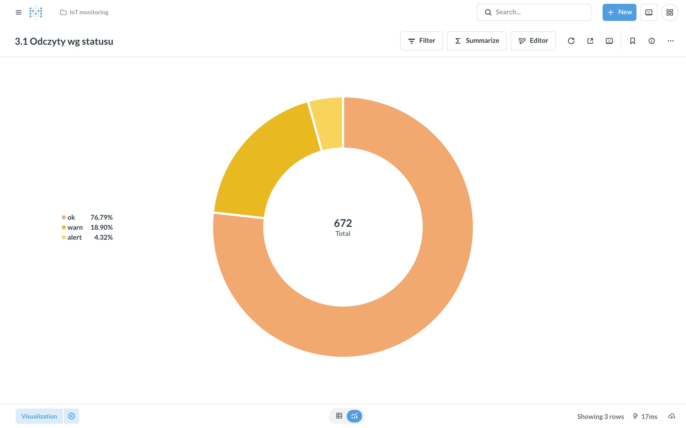
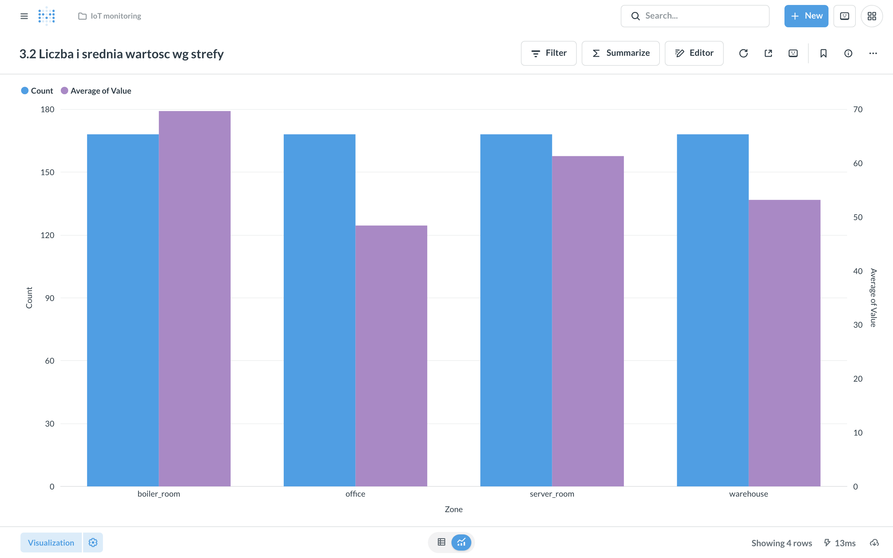
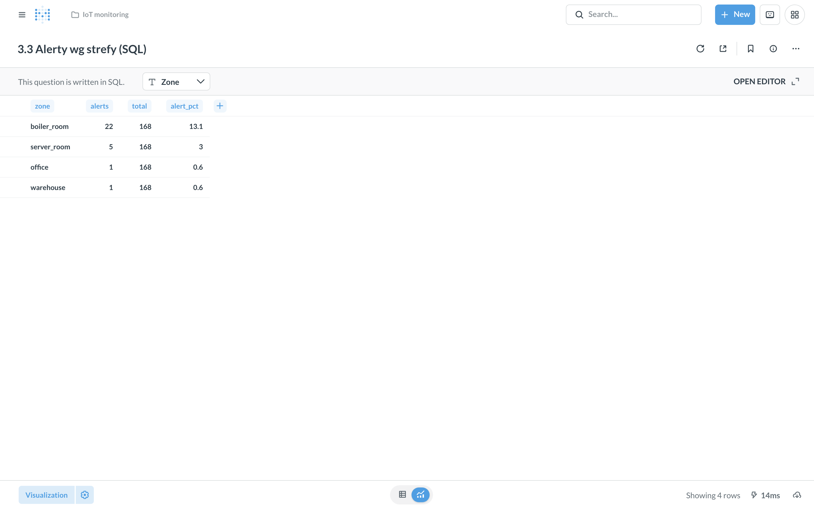
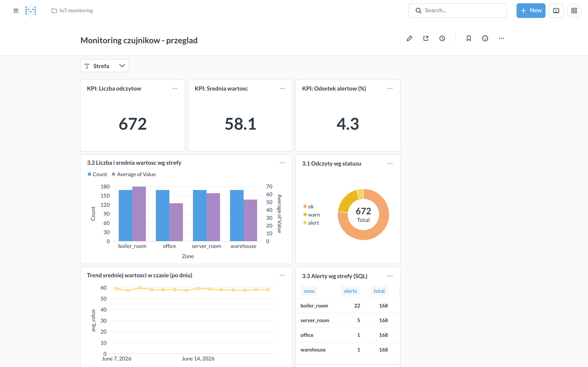
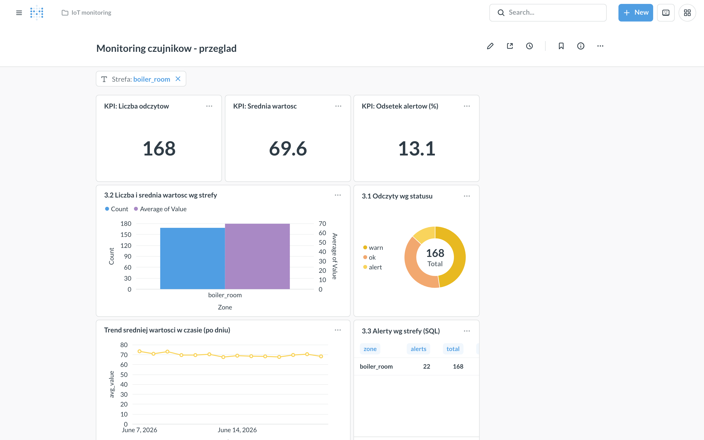
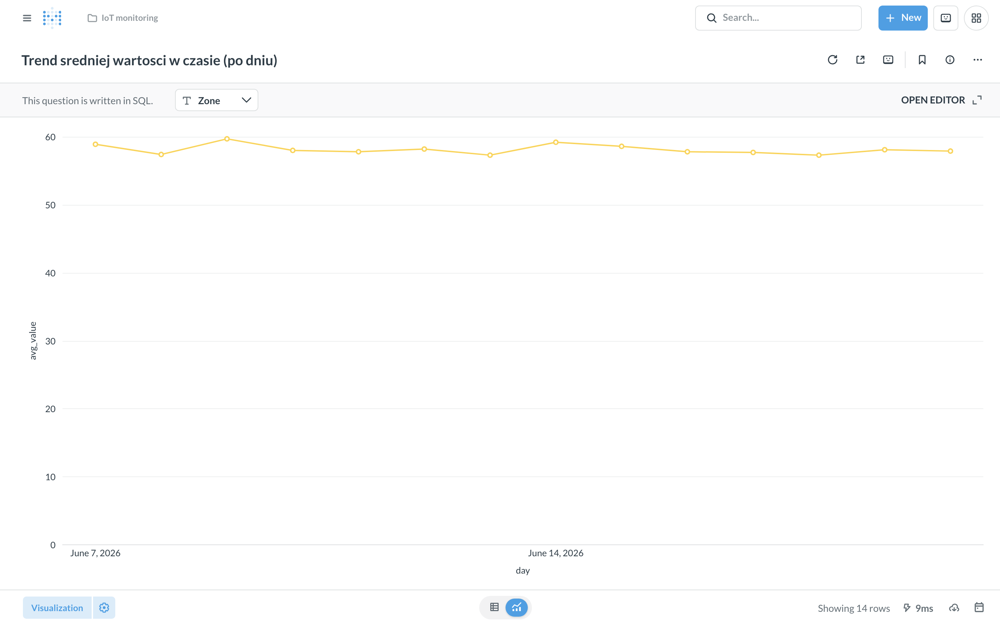
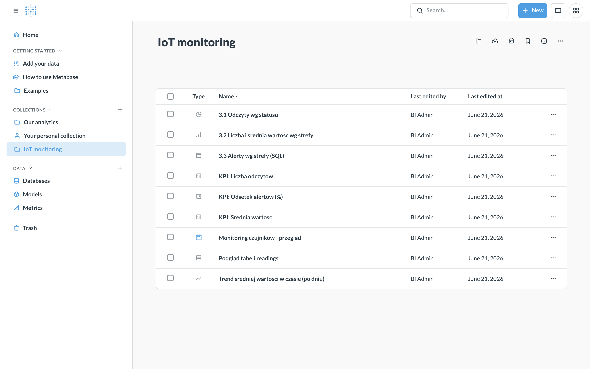

# LAB12 — Business Intelligence w Metabase

Analiza i wizualizacja telemetrii czujników IoT w narzędziu BI (Metabase) na bazie
analitycznej PostgreSQL. Dane wejściowe pochodzą z LAB11 (odczyty czujników ze
strumienia Spark), skonsolidowane do `data/readings.csv` o polach:
`reading_time, sensor_id, zone, value, state` (672 odczyty, 4 strefy, ~2 tygodnie).

## Uruchomienie projektu

Wymagany Docker + Docker Compose oraz Python 3.11.

```bash
# 1. hurtownia (PostgreSQL) + Metabase
docker compose up -d

# 2. srodowisko Python i zaladowanie danych
python3.11 -m venv .venv
.venv/bin/pip install -r requirements.txt
.venv/bin/python load_data.py

# 3. Metabase w przegladarce: http://localhost:3000 -> konto administratora
```

Konfigurację Metabase (admin, połączenie, kolekcja, 3 pytania + trend + KPI, dashboard
z filtrem) można odtworzyć automatycznie przez REST API:

```bash
.venv/bin/python setup_metabase.py
```

Skrypt zapisuje `mb_state.json` z id utworzonych obiektów. Konto admina:
`ada@sensors.local` / `Sensors!2026Ada`. Zrzuty w `screenshots/` wykonano headless
przeglądarką (Playwright) na realnie postawionym środowisku.

Log po `load_data.py`:

```
Zaladowano wierszy: 672 (w bazie: 672)
Zakres czasu: 2026-06-07 00:24:00 -> 2026-06-20 22:54:00
Strefy: boiler_room, office, server_room, warehouse
Statusy: {'ok': 516, 'warn': 127, 'alert': 29}
```

Zatrzymanie: `docker compose down` (z usunięciem danych: `docker compose down -v`).

---

## Zadanie 1 — Przygotowanie środowiska

Środowisko stawiane jednym poleceniem `docker compose up -d`
([`docker-compose.yml`](docker-compose.yml)):

| Usługa | Obraz | Wersja | Port |
|--------|-------|--------|------|
| Hurtownia danych | `postgres:16` | PostgreSQL **16.14** | `5432` |
| Narzędzie BI | `metabase/metabase:latest` | Metabase **v0.62.2.7** | `3000` |

Postgres ma `healthcheck` (`pg_isready`), a Metabase startuje dopiero po uzdrowieniu
bazy (`depends_on: condition: service_healthy`) bez wyścigu przy starcie. Po wejściu
na `http://localhost:3000` utworzono konto administratora. Gotowość bazy widać na
karcie połączenia (status Connected) w zad 2.

## Zadanie 2 — Załadowanie danych do bazy analitycznej

Dane (`data/readings.csv`) ładuje [`load_data.py`](load_data.py) przez SQLAlchemy +
psycopg2 do tabeli `readings` w bazie `sensors` (`if_exists="replace"`).

W Metabase dodano połączenie:

| Parametr | Wartość |
|----------|---------|
| Typ | PostgreSQL |
| Host | `postgres` (sieć Dockera) lub `localhost` |
| Port | `5432` |
| Baza | `sensors` |
| Użytkownik / hasło | `bi` / `bi` |

> Z kontenera Metabase host to `postgres` (nazwa usługi w sieci Compose), nie `localhost`.





## Zadanie 3 — Pytania (questions) i wykresy

**3.1. Kreator wizualny (bez SQL) — liczba odczytów wg statusu → wykres kołowy.**
`Summarize → Count`, `Group by → state`. Kołowy, bo udział rozłącznych
statusów w całości: `ok 76,79% (516)`, `warn 18,90% (127)`, `alert 4,32% (29)`.



**3.2. Agregacja wg kategorii (strefy) — liczba odczytów i średnia wartość → słupkowy.**
`Summarize → Count` oraz `Average of value`, `Group by → zone`. Słupkowy, bo
porównanie wartości między strefami Najwyższa średnia temperatura jest w
`boiler_room` (69,6), najniższa w `office` (48,4); liczba odczytów jest równa (168 / strefę).



**3.3. Pytanie zapisane jako SQL — alerty wg strefy → tabela.**

```sql
SELECT zone,
       COUNT(*) FILTER (WHERE state = 'alert')                              AS alerts,
       COUNT(*)                                                             AS total,
       ROUND(100.0 * COUNT(*) FILTER (WHERE state = 'alert') / COUNT(*), 1) AS alert_pct
FROM readings
GROUP BY zone
ORDER BY alerts DESC;
```

| zone | alerts | total | alert_pct |
|------|-------:|------:|----------:|
| boiler_room | 22 | 168 | 13.1 |
| server_room | 5 | 168 | 3.0 |
| office | 1 | 168 | 0.6 |
| warehouse | 1 | 168 | 0.6 |

Tabela, bo liczą się dokładne wartości i ranking. Pytanie ma field-filter
`{{zone_filter}}`, dzięki czemu działa z filtrem dashboardu.



Dobór wykresów: kołowy → udział części w całości (statusy); słupkowy → porównanie
wartości między strefami; liniowy → zmiana w czasie (trend, Zad. 4); tabela → dokładne
liczby, gdy ważna jest precyzja.

## Zadanie 4 — Dashboard

Dashboard "Monitoring czujników — przegląd" (7 kart), ułożony od KPI na górze do
szczegółów niżej:

1. KPI: liczba odczytów — 672
2. KPI: średnia wartość — 58,1
3. KPI: odsetek alertów — 4,3 %
4. Liczba i średnia wartość wg strefy — słupkowy
5. Odczyty wg statusu — kołowy
6. Trend średniej wartości w czasie — liniowy
7. Alerty wg strefy — tabela (SQL)



Filtr dashboardu (parametr `Strefa`) podpięty do wszystkich kart (karty kreatora
przez kolumnę `zone`, karty SQL przez field-filter `{{zone_filter}}`). Zmiana filtra
przelicza jednocześnie wszystkie karty — po ustawieniu `Strefa = boiler_room` KPI
zmieniają się na 168 / 69,6 / 13,1 %, a wykresy i tabela pokazują tylko tę strefę:



Analiza trendu w czasie. Wykres liniowy średniej wartości z
grupowaniem po dniu (`date_trunc('day', reading_time)`), na 14 dniach danych:

```sql
SELECT date_trunc('day', reading_time)::date AS day,
       ROUND(AVG(value)::numeric, 1)         AS avg_value
FROM readings
GROUP BY 1
ORDER BY 1;
```

Średnia dobowa jest stabilna (~57–60) — brak trendu rosnącego/malejącego, dobowe
wahania wygładzają się w agregacji dziennej. (Granulację łatwo zmienić na tydzień.)



## Zadanie 5 — Wskaźniki, analiza i udostępnianie

### Wskaźniki biznesowe (KPI)

| KPI | Definicja | Wartość |
|-----|-----------|--------:|
| Liczba odczytów | `COUNT(*)` | 672 |
| Średnia wartość | `AVG(value)` | 58,1 |
| Odsetek alertów | `alert / wszystkie` | 4,3 % |
| Odsetek stanów krytycznych | `(warn+alert) / wszystkie` | 23,2 % |

### Pytanie biznesowe: która strefa jest najbardziej zagrożona?

Z agregacji (Zad. 3.2 i 3.3): zdecydowanym liderem alertów jest boiler_room —
22 alerty (13,1 % odczytów) przy najwyższej średniej temperaturze (69,6). Druga
w kolejności `server_room` ma już tylko 5 alertów (3,0 %), a `office` i `warehouse`
po jednym (0,6 %). Wniosek: monitoring i ewentualną interwencję (chłodzenie, przegląd)
należy skupić na kotłowni — to tam ryzyko przekroczeń jest rząd wielkości wyższe niż
w pozostałych strefach.

### Udostępnianie wyników

- Kolekcja — wszystkie pytania i dashboard zapisano w kolekcji „IoT monitoring”.
- Eksport CSV — wynik pytania można pobrać przez `Download → .csv`.
- Dashboard publiczny / subskrypcja — w `Admin → Public sharing` można włączyć
  publiczny link albo subskrypcję e-mail.



### Różnice pojęciowe

Przetwarzanie danych a warstwa BI. Przetwarzanie (ETL/Spark z LAB11) czyści,
łączy i agreguje surowe odczyty — przygotowuje *poprawne* dane. Warstwa BI ich nie
zmienia, tylko czyni je *zrozumiałymi*: pytania, wykresy, dashboardy i wskaźniki dla
odbiorcy. Pierwsza odpowiada „jak przekształcić dane”, druga „co te dane mówią”.

Dashboard a raport statyczny. Dashboard jest interaktywny — filtry, drill-down,
dane odświeżane z bazy przy każdym wejściu. Raport statyczny (PDF) to zamrożony stan
na moment wygenerowania, bez interakcji; dobry do archiwum, ale szybko się dezaktualizuje.

Zapytanie ad-hoc a zdefiniowany wskaźnik. Ad-hoc to jednorazowe pytanie „tu i
teraz”, często niezapisane. Zdefiniowany wskaźnik (KPI) to uzgodniona, nazwana i
wielokrotnie używana definicja (np. „odsetek alertów = alert / wszystkie”) —
gwarantuje, że wszyscy liczą to samo tak samo.

### Metabase a inne narzędzie BI (na ocenę 5)

| Kryterium | Metabase | Apache Superset | Grafana |
|-----------|----------|-----------------|---------|
| Próg wejścia | bardzo niski (kreator bez SQL) | średni | średni |
| Mocna strona | szybkie self-service BI nad bazą SQL | bogate wykresy + SQL Lab | metryki/monitoring time-series |
| Licencja | open-source (+ płatna) | open-source (Apache) | open-source (+ płatna) |
| Najlepsze do | analiz i dashboardów ad-hoc | zaawansowanych analiz na hurtowni | dashboardów operacyjnych z metryk |

**Kiedy co:** Metabase — gdy chcemy szybko dać zespołowi self-service BI nad bazą
przy minimum konfiguracji (jak tutaj). 
Superset— gdy potrzeba szerszej biblioteki
wykresów i pełnej kontroli SQL w open-source. Grafana — gdy dane to przede
wszystkim szeregi czasowe z monitoringu (a telemetria IoT jest temu bliska, więc dla
podglądu na żywo z czujników Grafana też byłaby naturalnym wyborem; Metabase wygrywa
przy analizie biznesowej i ad-hoc pytaniach nad hurtownią).

---

## Struktura repozytorium

```
Lab12/
├── docker-compose.yml      # PostgreSQL 16 + Metabase
├── load_data.py            # data/readings.csv -> tabela readings (baza sensors)
├── setup_metabase.py       # konfiguracja Metabase przez REST API
├── requirements.txt        # pandas, SQLAlchemy, psycopg2-binary (+ requests, playwright)
├── data/
│   └── readings.csv        # 672 odczyty z LAB11 (reading_time,sensor_id,zone,value,state)
├── screenshots/            # zrzuty z Metabase (zob. powyzej)
└── README.md               # sprawozdanie (ten plik)
```
